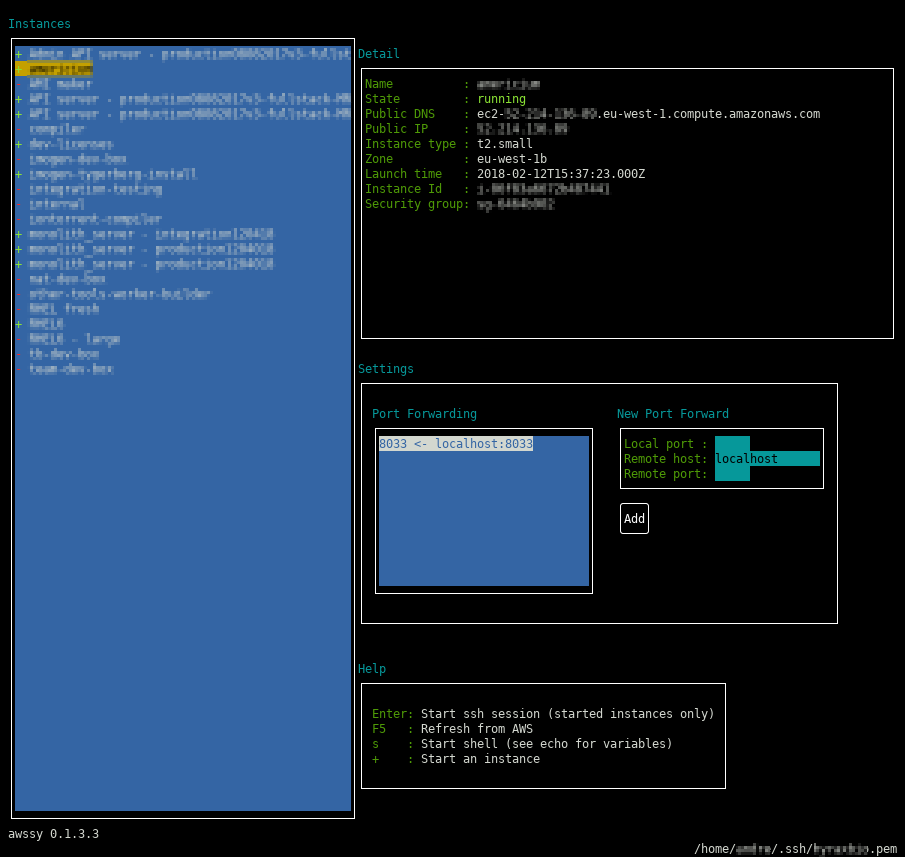

# awssy

Simple terminal GUI for the aws cli tool, for connecting to EC2 instances

# Usage

`awssy --help` to get help

or

`awssy --region MyRegion --key ~/.ssh/mykey_rsa --user ec2-user --cache`

The following defaults are used 
 - key: ~/.ssh/id_rsa
 - user: ec2-user
 - cache: disallowed
 
You must specify a region, one of
 - Beijing
 - Frankfurt
 - GovCloud
 - GovCloudFIPS
 - Ireland
 - London
 - Montreal
 - Mumbai
 - NorthCalifornia
 - NorthVirginia
 - Ohio
 - Oregon
 - SaoPaulo
 - Seoul
 - Singapore
 - Sydney
 - Tokyo

Caching means that your last fetch EC2 data will be used if awssy can not connect to AWS for some reason.

## Startup

When awssy starts up it will connect to EC2 to get the instance details, this can take a minute. The EC2 details are requested every 5 minutes, or when you press `F5`

## Starting a SSH session

Select a started instance and press `enter`. This will

 - Grant your current IP SSH access to the instance
 - Start a SSH session
 - When the SSH session ends, remove SSH instance for your IP

## Starting a terminal session

Select a started instance and press `s`. This will

 - Grant your current IP SSH access to the instance
 - Start a local terminal session with the following shell variables defined
   - AWS_H: The host IP
   - AWS_U: The user name (ec2-user)
   - AWS_K: Your selected ssh key
   - AWS_UH: user_name:host
   
   e.g. to copy a file `scp -i $AWS_K ./README.md $AWS_UH:/home/$AWS_U/README.md`
   
 - When the SSH session ends, remove SSH instance for your IP
